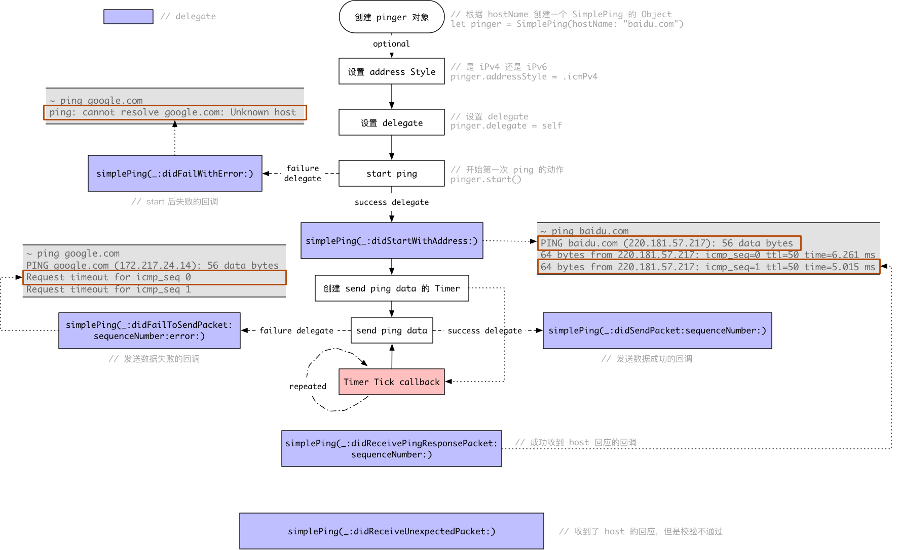
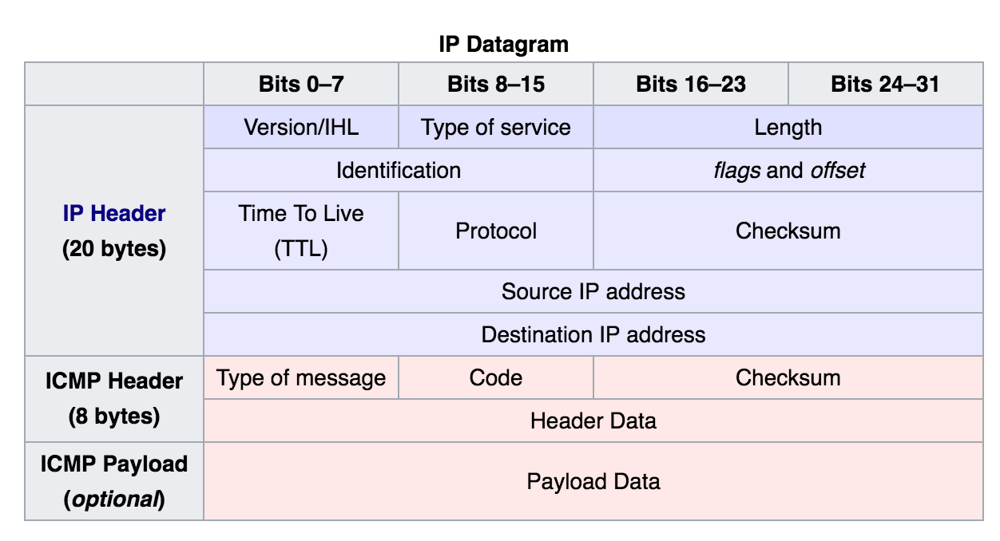

<!-- START doctoc generated TOC please keep comment here to allow auto update -->
<!-- DON'T EDIT THIS SECTION, INSTEAD RE-RUN doctoc TO UPDATE -->
**Table Of Contents**

- [读 Apple Sample Code 之 Simple Ping](#%E8%AF%BB-apple-sample-code-%E4%B9%8B-simple-ping)
  - [关于 ping](#%E5%85%B3%E4%BA%8E-ping)
  - [Demo 中 SimplePing 的使用](#demo-%E4%B8%AD-simpleping-%E7%9A%84%E4%BD%BF%E7%94%A8)
  - [SimplePing 的实现原理](#simpleping-%E7%9A%84%E5%AE%9E%E7%8E%B0%E5%8E%9F%E7%90%86)

<!-- END doctoc generated TOC please keep comment here to allow auto update -->

# 读 Apple Sample Code 之 Simple Ping

在翻 [Apple Developer Guides and Sample Code](https://developer.apple.com/library/content/navigation/) 的时候，顺着 Network 那一栏往下翻，看到了一个 [ping](https://en.wikipedia.org/wiki/Ping_(networking_utility)) 的[封装实现](https://developer.apple.com/library/content/samplecode/SimplePing/Introduction/Intro.html#//apple_ref/doc/uid/DTS10000716)。ping 是一个非常常用的命令，相信大家或多或少都有用过。

这个示例的封装实现了最基本的 ping 功能，其中包括 resolve host，create socket(send & recv data), 解析 ICMP 包验证 checksum 等。同时支持 iPv4 和 iPv6。其实就是对 Core Foundation 中网络相关的 C 函数的封装。

## 关于 ping

ping 是通过网络层的 IP 协议发送 ICMP 协议的数据包，然后等待目标回传 ICMP 数据包，通过时间和成功响应的次数估算丢包率和网络时延。

其实 ping 并不能完全代表你能不能链接上那个 host，像 zhihu.com 就封掉了 ICMP（ping 就没办法工作了，一直提示超时），但是通过浏览器（HTTP）还是能打开知乎的。

## Demo 中 SimplePing 的使用

下载好源码，发现 demo 是用 Swift 写的！可惜它使用的版本是 2.3（目前的 Swift 版本是 3.1），看来 Apple 的这些 Sample Code 更新的不是很及时。不过还好代码量比较少，Xcode 帮忙升级，自己再 fix 一两处，项目就可以 run 起来了。

Demo 中使用 SimplePing 的基本流程如下，



其实主要的流程也就以下几个部分，

- 初始化。包括创建 pinger 对象，设置想要 iPv4 还是 iPv6 的地址，设置 delegate
- 调用 `start()` 方法，开启 ping 的流程。pinger 会把对应的 host 解析成 IP 地址
- 在需要的情况下调用 `send` 方法。探测对应的 host，delegate 中的回调就会得到对应的回应了。 

## SimplePing 的实现原理

ping 的实现过程并不复杂，一共以下几个步骤，

- 解析传入的 host，获取第一个可用 IP 地址
- 创建传输/接收数据的 socket
- 发送数据，封装一个 ICMP 包 
- 解析目标 IP 传回的 ICMP 包

不要觉得 ICMP 包之类是什么高深高难的词语，其实它就是一个协议。双方规定好一个数据包的前几个字节是什么，后几个字节是什么，双方按照正确的格式封装包的数据发送或者解析就可以了。



ICMP 是位于网络层的一个协议，它依靠 IP 来完成工作。如上图所示，ICMP 的包会有 IP 的 header，但这个 header 对于我们实现 ping 是没有什么必要性的，可以看到代码也有一个方法 `icmpHeaderOffsetInIPv4Packet:` 计算 IP header 的 offset 从而直接跳过 IP 头。

项目中对 ICMPHeader 也做出了定义，

```c
struct ICMPHeader {
    // iPv4 or iPv6
    uint8_t     type;
    // 0
    uint8_t     code;
    // 0
    uint16_t    checksum;
    // 初始化 host 的时候随机生成的 id
    uint16_t    identifier;
    // 类内部维护的，发送 ping 数据的序号
    uint16_t    sequenceNumber;
    // data...
};
typedef struct ICMPHeader ICMPHeader;
```

发送 ping 数据的时候，会对一个 ICMPHeader 结构体进行初始化，除了上述的几个字段，结合上面的那张图看到，还有 payload，如果调用者没有指定发送的 payload，方法内部会添加默认的 payload。

接收回应的时候，会对 ICMP 包进行校验，也会跳过 IP 头，其中主要验证的字段是 checksum 和 sequenceNumber（iPv6 只需要验证 sequenceNumber）。checksum 的计算根据的是标准的 BSD checksum 生成函数，主要依据是 ICMP 包，计算规则没细看，因为它是一种标准嘛（想看的同学可以看这里 [IPv4 header checksum](https://en.wikipedia.org/wiki/IPv4_header_checksum)）。

至此，一次 ping 的完整流程就结束了。

## 一些其它的点

上次看了 Reachability，这次看了 Simple Ping，其实都是对 Core Foundation 中的 C 函数进行封装。其中让我觉得比较关键的点就是对 Core Foundation 中异步函数的调用和内存管理问题。


Core Foundation 中的异步方法设置一般需要以下几个步骤，

- 创建相关的 context，一般都是把 self 存到 info 字段中，方便从 callback 中提取出对象然后调用处理的 Objective-C 方法（`CFHostClientContext context = {0, (__bridge void *)(self), NULL, NULL, NULL};`）
- 创建一个与 callback 函数指针相同签名的静态函数，处理异步方法回调后的逻辑

```c
static void HostResolveCallback(CFHostRef theHost, CFHostInfoType typeInfo, const CFStreamError *error, void *info) {
    /// 从 info 中就可以取出 Objective-C 中的 object
    SimplePing *obj = (__bridge SimplePing *) info;
    /// .... 
}
```

- 设置 callback、context 等相关参数 `CFHostSetClient(self.host, HostResolveCallback, &context);`

- 设置函数需要执行的 runloop 及 runloop mode `CFHostScheduleWithRunLoop(self.host, CFRunLoopGetCurrent(), kCFRunLoopDefaultMode);`
- 开始执行 `CFHostStartInfoResolution(self.host, kCFHostAddresses, &streamError)`，如果成功，那我们的 callback 就会被调用。


在 callback 中，如果没有错误，就可以开始解析 `CFHostRef` 中的 IP 地址了，这里是只取了 IP 地址列表中的第一个，如果它的 AddressStyle(iPv4 or iPv6) 不是所期望的 Style，也会提示失败。不管成功还是失败都会把 `self.host` 给释放掉，因为它的作用只是获得 host 所对应的的一个 IP 地址而已。

然后就开始的 ping 的过程(`startWithHostAddress`)，


